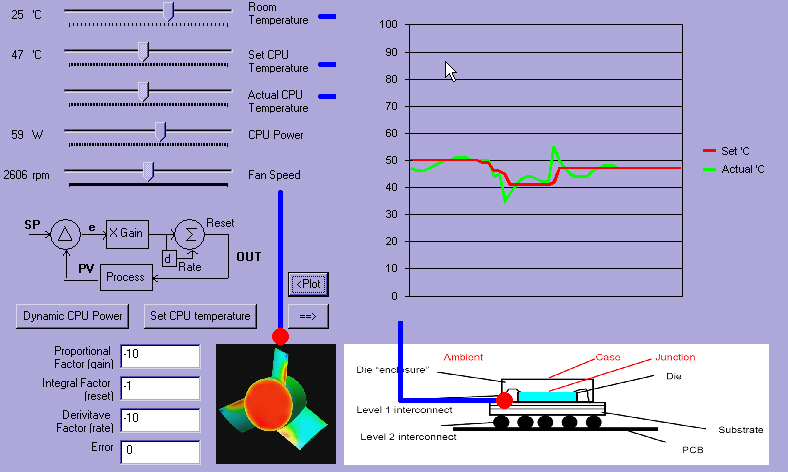

## PID PC fan control

### Description

This code provide a computer fan control policy based on PID theory. The code suppose that the downloader understand the basic theory of PID control and computer cooling technology. The physical model of cpu temperature vs power & fan speed was not real. I use a hypothetical equation. The P, I, D factor could be reset manually. And the cpu temperature setting point could be change with thermal profile. In the code, I use one of AMD operton cpu thermal profile for your reference. The last one: in the actual world, the pc thermal control policy was not using PID control. Normally, we control the fan speed vs cpu temperature as linear relationship. It was easy for BIOS codeing.
 
### More Info
 

             |
---                |---
**Submitted On**   |2011-12-21 16:38:52
**By**             |[Duzi Huang](https://github.com/Planet-Source-Code/PSCIndex/blob/master/ByAuthor/duzi-huang.md)
**Level**          |Advanced
**User Rating**    |3.7 (11 globes from 3 users)
**Compatibility**  |VB 6\.0
**Category**       |[Coding Standards](https://github.com/Planet-Source-Code/PSCIndex/blob/master/ByCategory/coding-standards__1-43.md)
**World**          |[Visual Basic](https://github.com/Planet-Source-Code/PSCIndex/blob/master/ByWorld/visual-basic.md)
**Archive File**   |[PID\_PC\_fan22168812212011\.zip](https://github.com/Planet-Source-Code/duzi-huang-pid-pc-fan-control__1-74222/archive/master.zip)

